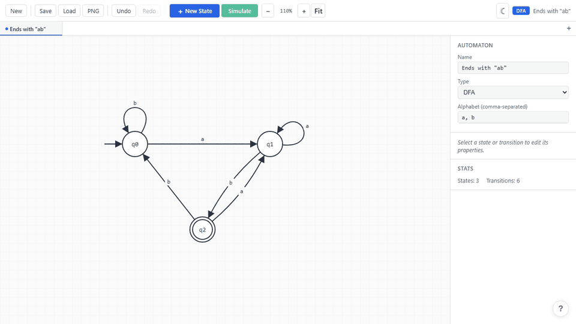
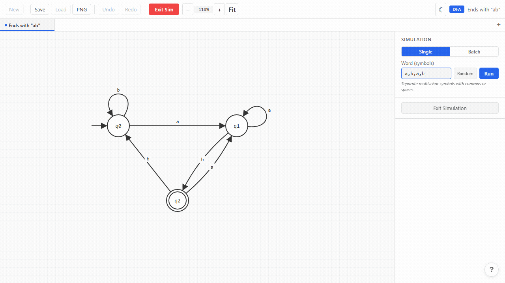
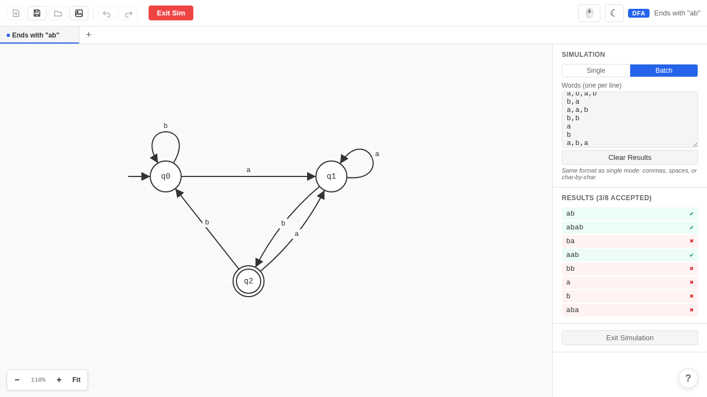

# Automata Simulator

> **[Try it live at automata.yuweiss.dev](https://automata.yuweiss.dev/)**

A web-based visual editor and simulator for finite automata (DFA, NFA, and PDA). Build automata with an interactive diagram editor, simulate words step-by-step, save/load your work, and edit states and transitions with a professional interface. Works on desktop, tablet, and phone with full touch support.

<p align="center">
  
</p>

### Step-by-step simulation

Watch the automaton process each symbol in real time — active states glow and transitions highlight as the trace advances.

<p align="center">
  
</p>

### Batch simulation

Test multiple words at once and instantly see which are accepted or rejected.

<p align="center">
  
</p>

## Features

- **Interactive diagram editor** — drag states to reposition, scroll to zoom, drag canvas to pan
- **Word simulation** — step-by-step DFA/NFA/PDA simulation with visual state/transition highlighting; Run auto-plays the animation and shows the final result
- **Batch simulation** — test multiple words at once, see accept/reject results for each
- **Pre-simulation validation** — detects DFA symbol conflicts, missing transitions, no initial state; suggests switching to NFA when conflicts are found
- **Auto-run & speed control** — auto-step through simulation at configurable speed (100ms–2s)
- **DFA, NFA & PDA support** — toggle between deterministic, nondeterministic, and pushdown automata modes
- **Epsilon transitions** — NFA supports ε-transitions with automatic epsilon-closure during simulation
- **PDA stack operations** — define transitions with input symbol, stack pop, and stack push; supports final-state and empty-stack acceptance modes with real-time stack visualization during simulation
- **Textbook-quality diagrams** — double circles for accepting states, curved arrows, self-loops
- **Smart self-loop placement** — self-loops automatically position away from connected edges and the initial arrow
- **Smart edge routing** — fan-out edges from the same state are offset to avoid overlap
- **Snap-to-alignment** — states snap to horizontal/vertical alignment when dragged near other states, with visual guide lines
- **New diagram with q0** — new automata start with an initial state already placed
- **Hover "+" hint** — hover on empty canvas to see a placement hint; click to add a state
- **Random word generator** — generate a random word from the alphabet for quick testing
- **Zoom controls** — scroll to zoom + toolbar +/- buttons with percentage display + fit-to-content
- **Dark mode** — toggle between light and dark themes; respects system preference
- **PNG export** — export the diagram as a high-resolution PNG image
- **Tabs** — work on multiple automata simultaneously; each tab has independent state, undo history, and file handle; Ctrl+T/W to create/close, Ctrl+PgDn/PgUp to switch
- **Save/Load** — export to JSON, import with exact visual state restoration (positions, zoom, viewport); re-saves to same file per tab (Chromium)
- **Auto-save** — all tabs automatically saved to browser storage; restored on page reload
- **Unsaved changes warning** — browser warns before closing tab with unsaved work
- **Undo/Redo** — full undo/redo history (Ctrl+Z / Ctrl+Shift+Z)
- **Properties panel** — edit state names, toggle initial/accepting, modify transition symbols
- **Styled transition editor** — custom modal for entering/editing transition symbols (no browser prompts)
- **Intuitive interactions** — click two states to create a transition; double-click for self-loop; drag handle on hover; drag handle to empty space to create a state + transition
- **Multi-select** — Shift+click to toggle states in selection; Shift+drag on canvas for rubber-band selection; group drag moves all selected states together
- **Help tooltip** — `?` button at bottom-right shows all keyboard shortcuts, instructions, and credits; auto-opens on first visit
- **Mobile & touch support** — fully responsive touch UI for phones (< 640px) and tablets (640–1024px):
  - **Phone layout** — bottom sheet panel, top bar with hamburger menu and tab dropdown, bottom bar with edit/simulate actions
  - **Tablet layout** — hamburger menu, tab bar, bottom bar, side properties panel
  - **Touch gestures** — tap to select, double-tap for self-loop/edit symbols, long-press for context menu, pinch to zoom, drag to pan/move
  - **Tap-tap transitions** — tap source state, then tap target within 3s to create a transition
  - **File operations on all devices** — Save/Load/Export PNG available via hamburger menu on phone and tablet; uses native file picker on Chromium (Windows touch, Android Chrome) and file-saver fallback on iOS Safari
  - **UI mode override** — toggle between touch and desktop UI modes from the hamburger menu

## How to Use (Desktop)

1. **Add states** — click "+ New State" in the toolbar (or press N), then click on the canvas to place
2. **Create transitions** — click a source state, then click a target state within 3 seconds
3. **Create self-loops** — double-click a state
4. **Drag-to-connect** — hover over a state to reveal the arrow handle, drag it to another state (or to empty space to create a new state)
5. **Edit transition symbols** — double-click any transition to edit its symbols
6. **Edit properties** — click any state or transition to see its properties in the right panel
7. **Move states** — drag states to reposition (they snap to alignment with other states)
8. **Multi-select** — Shift+click states to add/remove from selection; Shift+drag on canvas for rubber-band selection; drag moves all selected states
9. **Delete** — select element(s) and press Delete or Backspace
10. **Undo/Redo** — Ctrl+Z to undo, Ctrl+Shift+Z to redo
11. **Save** — click "Save" or press Ctrl+S
12. **Load** — click "Load" or press Ctrl+O and select a JSON file

## How to Use (Mobile / Touch)

1. **Add states** — tap "+ State" in the bottom bar, then tap the canvas to place
2. **Create transitions** — tap a source state, then tap a target state within 3 seconds
3. **Create self-loops** — double-tap a state
4. **Edit transition symbols** — double-tap any transition to edit its symbols
5. **Move states** — drag states to reposition (they snap to alignment with other states)
6. **Context menu** — long-press a state or transition for options (delete, toggle accepting/initial)
7. **Zoom & pan** — pinch to zoom, drag empty canvas to pan
8. **Delete** — select an element and tap the Delete button in the bottom bar
9. **Undo/Redo** — use the Undo/Redo buttons in the bottom bar
10. **Save/Load** — open the hamburger menu (top-left) and tap Save or Load
11. **Export PNG** — open the hamburger menu and tap Export PNG
12. **Switch tabs** — use the tab dropdown (phone) or tab bar (tablet) at the top

## Simulation

1. Click **Simulate** in the toolbar (or build your automaton first)
2. Enter a word (e.g., `a,b,a` or `aba`), or click **Random** to generate one, then click **Run** — the animation auto-plays and shows the final accept/reject result
3. Use step controls or keyboard shortcuts to replay the trace
4. Active states glow green; traversed transitions are highlighted
5. Switch to **Batch** mode to test multiple words at once (one per line)
6. Press **Escape** or click **Exit Sim** to return to editing

## Keyboard Shortcuts (Desktop)

| Key | Action |
|-----|--------|
| N | New State (click canvas to place) |
| Space | Toggle accepting (when state selected) |
| Delete / Backspace | Delete selected element(s) |
| Escape | Cancel / Exit simulation |
| Ctrl+Z | Undo |
| Ctrl+Shift+Z / Ctrl+Y | Redo |
| Ctrl+A | Select all states |
| Ctrl+S | Save to file |
| Ctrl+O | Load from file |
| Ctrl+N | New automaton |
| Ctrl+T | New tab |
| Ctrl+W | Close tab |
| Ctrl+PgDn / PgUp | Switch to next / previous tab |

### During Simulation

| Key | Action |
|-----|--------|
| Space | Step forward / Run |
| Enter | Toggle auto-run |
| Left / Right arrow | Step backward / forward |
| Escape | Exit simulation |

## Touch Gestures (Mobile / Tablet)

| Gesture | Action |
|---------|--------|
| Tap | Select state or transition |
| Double-tap state | Create self-loop |
| Double-tap transition | Edit symbols |
| Long-press | Context menu (delete, toggle accepting/initial) |
| Drag state | Move state |
| Drag empty area | Pan canvas |
| Pinch | Zoom in/out |

## Quick Start (Docker)

### Prerequisites
- Docker and Docker Compose

### Development Server
```bash
docker compose up dev
```
Open http://localhost:5173 in your browser. Changes in `src/` will hot-reload.

### Run Tests
```bash
# Unit tests (Vitest)
docker compose run --rm test

# E2E tests (Playwright)
docker compose run --rm e2e
```

### Production Build
```bash
docker compose up prod
```
Serves the optimized build at http://localhost:8080.

## Project Structure

```
src/
├── models/        # Data types: Automaton, State, Transition, Zod schemas
├── stores/        # Zustand stores: automaton data, editor UI, undo/redo history, simulation
├── components/
│   ├── canvas/    # SVG rendering: states, transitions, arrows, grid, symbol modal
│   ├── toolbar/   # File operations, new state button, undo/redo
│   ├── panels/    # Properties panel for editing selected elements
│   ├── mobile/    # Phone/tablet UI: hamburger menu, bottom bar, bottom sheet, tab dropdown
│   └── help/      # Keyboard shortcuts & touch gestures tooltip
├── services/
│   ├── serialization/  # JSON save & load with Zod validation
│   ├── layout/         # Edge routing, Bezier curves, label overlap avoidance, self-loop placement
│   ├── simulation/     # DFA/NFA/PDA trace engine, pre-simulation validator
│   └── export/         # PNG image export
├── hooks/         # Keyboard shortcuts, touch canvas, auto-save, unsaved warning, theme, viewport detection
└── utils/         # Math, Bezier, ID generation, snap-to-alignment, random word, fit viewport
tests/
├── unit/          # 305 tests covering simulation, stores, serializers, edge-routing, touch, utils
```

## Auto-save

The current automaton is automatically saved to browser localStorage every 500ms after changes. When you reopen the page, your work is restored automatically. Creating a new automaton clears the auto-save.

## Tech Stack

- React 18 + TypeScript + Vite 6
- Custom SVG rendering (no graph library dependency)
- Zustand for state management
- Zod for save/load schema validation
- Vitest for unit tests, Playwright for E2E tests
- Docker + Express for deployment
